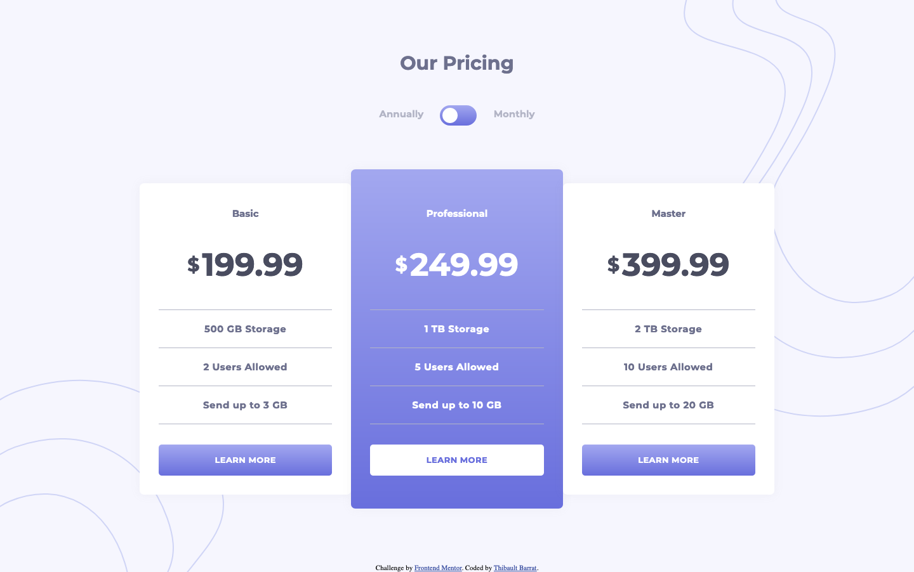

# Frontend Mentor - Pricing component with toggle solution

This is a solution to the [Pricing component with toggle challenge on Frontend Mentor](https://www.frontendmentor.io/challenges/pricing-component-with-toggle-8vPwRMIC). Frontend Mentor challenges help you improve your coding skills by building realistic projects. 

## Table of contents

- [Overview](#overview)
  - [The challenge](#the-challenge)
  - [Screenshot](#screenshot)
  - [Links](#links)
- [My process](#my-process)
  - [Built with](#built-with)
  - [Useful resources](#useful-resources)
- [Author](#author)

## Overview

### The challenge

Users should be able to:

- View the optimal layout for the component depending on their device's screen size
- Control the toggle with both their mouse/trackpad and their keyboard
- **Bonus**: Complete the challenge with just HTML and CSS

### Screenshot

### Links

- Solution URL: [https://www.frontendmentor.io/solutions/pricing-toggle-with-only-css-NY7ZJ6iI0](https://www.frontendmentor.io/solutions/pricing-toggle-with-only-css-NY7ZJ6iI0)
- Live Site URL: [https://pricing-component-with-toggle-gray.vercel.app/](https://pricing-component-with-toggle-gray.vercel.app/)

## My process

### Built with

- Semantic HTML5 markup
- Flexbox
- SASS preprocessor
- BEM methodology
- Mobile-first workflow
- Only CSS

### Useful resources

- [How TO - Toggle Switch](https://www.w3schools.com/howto/howto_css_switch.asp) - A nice example of toggle switch in CSS.

## Author

- Website - [Thibault Barrat](https://www.thibault-barrat.com/)
- Frontend Mentor - [@thibault-barrat](https://www.frontendmentor.io/profile/thibault-barrat)
- Twitter - [@Thib_Bar](https://www.twitter.com/Thib_Bar)

